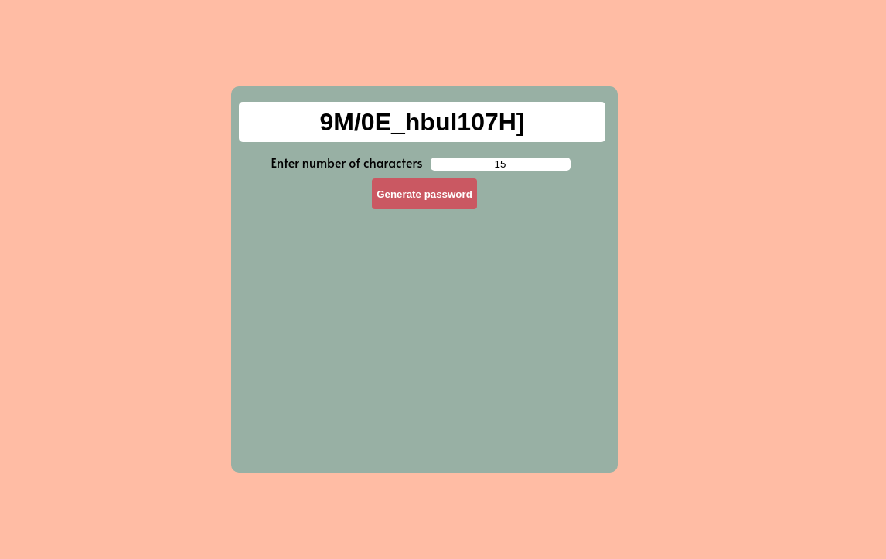

## What is this?
A simple password generator using react.

## How to use it?
**Step 1:** Clone or download the project to your local machine(preferred way is cloning).   
Type this to clone:  
### `git clone https://github.com/charan1973/password-generator.git`  

**Step 2:** Install necessary packages to run the app. In this case react only.    
First go into the directory using:  
### `cd password-generator`  
To install:
### `npm install`  
This is will get the necessary packages from package.json and install it for you. Pretty easy right I know.  

**Step 3:** Actually running this amazing app.    
To do so, type:  
### `npm start`  
You don't have to do anything. The app will start automatically and will be opened in your default browser.  

That's it you are gonna experience a whole new experience in generating passwords. Just kidding. Press generate and copy by clicking on the password.